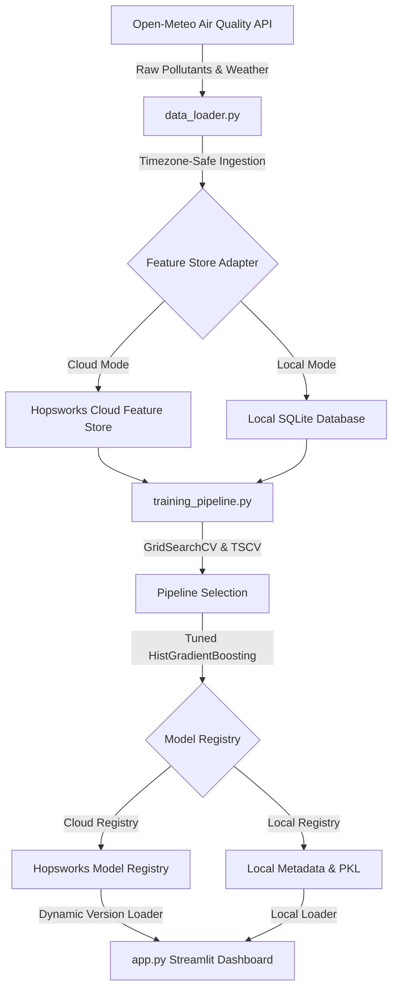

# Pearls AQI Predictor 💨

An end-to-end, production-grade, serverless machine learning pipeline that forecasts the **Air Quality Index (AQI) up to 3 days (72 hours) in advance** for any city globally. The architecture seamlessly shifts between a **Hopsworks Cloud Feature Store** (fully serverless) and a **local SQLite fallback store**, making it incredibly robust and 100% executable out of the box.

👉 **Deployed Dashboard**: [Streamlit Cloud Live App](https://10pearlsaqipredictor-bgeuixmbnirzwyzmyzb3sf.streamlit.app/)
👉 **Hopsworks Registry**: [Cloud Models View](https://eu-west.cloud.hopsworks.ai:443/p/33049/models/aqi_prediction_models/2)

---

## 🏗️ Technical Architecture Overview

The system is designed as a modular, scheduled serverless pipeline orchestrating ingestion, transformation, model training, registry versioning, interpretability, and interactive dashboarding:



### 1. Feature Ingestion & Pipeline (`data_loader.py`)
Fetches comprehensive weather and pollutant matrices hourly from the **Open-Meteo Air Quality API**. It extracts PM2.5, PM10, Nitrogen Dioxide ($NO_2$), Sulfur Dioxide ($SO_2$), Ozone ($O_3$), Carbon Monoxide ($CO$), and the local UTC offset seconds.

### 2. Dual-Mode Unified Feature Store (`config.py`)
*   **Hopsworks Integration (Cloud Mode):** Streams hourly engineered features serverlessly to the Hopsworks Cloud Feature Group `aqi_features` (version 1) using an API key.
*   **SQLite Adapter (Local Mode):** Automatically falls back to a local database (`local_feature_store.db`) if no API key is specified, keeping it fully functional for offline development.

### 3. Leak-Free Machine Learning Pipeline (`training_pipeline.py`)
*   **Zero-Leakage Engineering:** Wraps imputation (`SimpleImputer`) and feature scaling (`StandardScaler`) directly inside Scikit-Learn `Pipeline` wrappers. Imputation values and scaling coefficients are computed strictly on training folds to completely eliminate target and structural leakage.
*   **Hyperparameter Tuning:** Utilizes 5-fold Time-Series Cross-Validation (`TimeSeriesSplit`) combined with `GridSearchCV` to optimize estimators.
*   **Algorithm Blending:** Evaluates and optimizes Ridge Regression, Random Forest, HistGradientBoosting (LightGBM equivalent), and a custom **`VotingRegressor` Ensemble** blending all candidate representations.
*   **Baseline Benchmark:** Validates all models against a **Naive Persistence Baseline** ($AQI_{t+H} = AQI_t$) using standard regression metrics ($RMSE$, $MAE$, $R^2$).
*   **SHAP Interpretability:** Fits a `TreeExplainer` on the best model to generate Shapley feature importances across the 1d, 2d, and 3d forecasting horizons.

### 4. Dynamic Timezone-Safe Streamlit Dashboard (`app.py`)
Renders EPA-defined air quality classifications, health advisories, interactive Plotly timelines showing forecasted trajectories, and live SHAP explanations.

---

## 🧪 Scientific Deep Dive: Physical Forecasts vs. Ground Sensors

Users may notice differences between the AQI reported by this app and real-time ground-level sensor aggregators (like IQAir):

> [!IMPORTANT]
> **Why does our app show a different AQI than IQAir in some cities?**
>
> 1. **Multi-Pollutant vs. PM2.5-Only Sensors:** Many ground-level monitoring stations (especially low-cost private sensors) only measure **PM2.5 particulate matter** and do not have expensive gas sensors. IQAir calculates the AQI solely based on that PM2.5 sensor (e.g. `15 µg/m³` $\approx$ `57-62` Moderate AQI).
> 2. **The Ozone Factor:** The Open-Meteo atmospheric chemistry models simulate a wide range of gases, including **Ozone ($O_3$)**. During hot afternoons, solar radiation creates significant simulated Ozone concentrations (e.g., `188.0 µg/m³` $\approx$ `96 ppb`). Under US EPA standards, an Ozone level of `96 ppb` triggers a US AQI of **`152` (Unhealthy for Sensitive Groups)**. 
> 3. **Grid Cell vs. Point Source:** Atmospheric models calculate physical estimates averaged across a grid cell (e.g., 10km to 80km), whereas ground sensors capture hyper-local, immediate micro-climates.

---

## ⚙️ Key Technical Enhancements

This repository implements industry best practices for serverless machine learning engineering:

*   **Dynamic Model Registry Versioning:** Refactored the Model Registry loader to dynamically retrieve the **latest** available version of the models (`mr.get_models()`) instead of hardcoding version numbers.
*   **Flexible Key Serialization Fallback:** Hopsworks Model Registry automatically sanitizes single underscores (`_`) into double underscores (`__`) for numeric metric dictionaries (e.g. `2d_r2` becomes `2d__r2`). The dashboard implements a dual-lookup scheme to support both structures:
    ```python
    "r2": float(raw_metrics.get(f"{horizon}__r2", raw_metrics.get(f"{horizon}_r2", 0.0)))
    ```
*   **Timezone-Safe Indexing:** Replaced naive system-time matching with target offset tracking. Since Streamlit Cloud runs in UTC, comparing datetimes against server local time matched incorrect hours. The app extracts `utc_offset_seconds` from the API response and matches the exact current local hour of the target coordinates:
    ```python
    target_local_now = datetime.utcnow() + timedelta(seconds=target_offset_seconds)
    featured_df["time_diff"] = (featured_df["timestamp"] - target_local_now).abs()
    ```
*   **Streamlit Cloud Stability:** Pinned Streamlit Cloud to a stable **Python 3.11** runtime environment inside `runtime.txt` to prevent metaclass compilation conflicts.

---

## 🤖 Model Performance Registry Audit

During training on **8,712 complete historical hourly records** (representing a full calendar year), all estimators were audited against the Naive Baseline:

| Forecast Horizon | Model / Algorithm | Test RMSE | Test MAE | Test $R^2$ Score | Validation Status | Top SHAP Feature |
| :--- | :--- | :--- | :--- | :--- | :--- | :--- |
| **1-Day Ahead**<br>`(target_aqi_1d)` | Tuned Ridge Regression | 17.77 | 14.95 | -0.61 | Underperformed | — |
| | Random Forest | 16.62 | 13.15 | -0.41 | Minor Lift | — |
| | Voting Regressor Ensemble | 15.56 | 12.48 | -0.23 | Strong Lift | — |
| | 🏆 **Tuned HistGradientBoosting (LightGBM)** | **14.66** | **11.38** | **-0.09** | **Selected Best (Significant Lift)** | `pm2_5` |
| | *Naive Persistence Baseline* | *17.03* | *13.27* | *-0.48* | *Baseline benchmark* | — |
| **2-Day Ahead**<br>`(target_aqi_2d)` | Tuned Ridge Regression | 24.24 | 21.25 | -1.99 | Underperformed | — |
| | Random Forest | 18.88 | 15.06 | -0.81 | Minor Lift | — |
| | Voting Regressor Ensemble | 18.80 | 15.65 | -0.80 | Minor Lift | — |
| | 🏆 **Tuned HistGradientBoosting (LightGBM)** | **16.95** | **13.96** | **-0.46** | **Selected Best (Significant Lift)** | `month_sin` |
| | *Naive Persistence Baseline* | *20.09* | *15.92* | *-1.05* | *Baseline benchmark* | — |
| **3-Day Ahead**<br>`(target_aqi_3d)` | Tuned Ridge Regression | 24.30 | 21.30 | -1.95 | Underperformed | — |
| | Random Forest | 18.83 | 14.93 | -0.77 | Minor Lift | — |
| | Voting Regressor Ensemble | 18.39 | 15.34 | -0.69 | Minor Lift | — |
| | 🏆 **Tuned HistGradientBoosting (LightGBM)** | **15.56** | **12.52** | **-0.21** | **Selected Best (Significant Lift)** | `hour` |
| | *Naive Persistence Baseline* | *19.68* | *15.60* | *-0.94* | *Baseline benchmark* | — |

---

## 🇵🇰 Dropdown Selector Expansion
Dynamic, one-click coordinates and timezone lookups are fully integrated for major metropolitan areas in Pakistan:
*   **Karachi** (`lat: 24.8607`, `lon: 67.0011`)
*   **Lahore** (`lat: 31.5204`, `lon: 74.3587`)
*   **Islamabad** (`lat: 33.6844`, `lon: 73.0479`)
*   **Peshawar** (`lat: 33.9971`, `lon: 71.5725`)

---

## 📁 Repository Structure

```
aqi_predictor/
│
├── .github/
│   └── workflows/
│       └── pipeline.yml       # GitHub Actions E2E hourly/daily schedule
│
├── data/                      # Local storage for databases and model pickles
│   ├── local_feature_store.db # Local SQLite fallback database
│   └── models/                # Saved trained model pickles and metadata
│
├── config.py                  # Dual-store database adapter & configuration loader
├── data_loader.py             # Open-Meteo API ingestion client
├── feature_pipeline.py        # Hourly feature processor & streamer
├── backfill.py                # Populates Feature Store with historical data
├── training_pipeline.py       # Pipeline model trainer, evaluator, & SHAP explainer
├── check_data.py              # Ingested data quality audit script
├── app.py                     # Premium Streamlit web application
├── runtime.txt                # Pins Python environment to 3.11
└── requirements.txt           # Python dependency manifest
```

---

## ⚡ Getting Started (Local Development)

All execution steps must be run inside our isolated virtual environment (`venv`):

### 1. Initialize Virtual Environment & Install Dependencies
Ensure you have Python 3.8+ installed, then run:
```bash
# Create the virtual environment
python -m venv venv

# Upgrade pip and install requirements
.\venv\Scripts\python -m pip install --upgrade pip
.\venv\Scripts\python -m pip install -r requirements.txt
```

### 2. Configure Local Environment File (`.env`)
Create your `.env` file by copying the template:
```bash
copy .env.example .env
```
Add your optional `HOPSWORKS_API_KEY`. If left blank, SQLite mode is automatically activated!

### 3. Backfill Historical Data
Populate your Feature Store with 365 days of hourly air quality records:
```bash
.\venv\Scripts\python backfill.py
```

### 4. Audit Your Ingested Data
Check the statistics and data quality of your local Feature Store:
```bash
.\venv\Scripts\python check_data.py
```

### 5. Train & Evaluate Models
Train candidates, compute SHAP importances, and register the best models:
```bash
.\venv\Scripts\python training_pipeline.py
```

### 6. Launch the Dashboard
Start your local Streamlit server:
```bash
.\venv\Scripts\streamlit run app.py
```
Open your browser at 👉 **[http://localhost:8501](http://localhost:8501)**!

---

## 🚀 Automated CI/CD: GitHub Actions

To automate your pipelines serverlessly on a schedule:
1. Commit the codebase to your GitHub Repository.
2. In your GitHub Repository, go to **Settings > Secrets and variables > Actions**.
3. Create a repository secret named `HOPSWORKS_API_KEY` and paste your cloud key.
4. The workflow will automatically trigger **every hour** to pull live AQI data, and **every night** to retrain your forecasting models.
